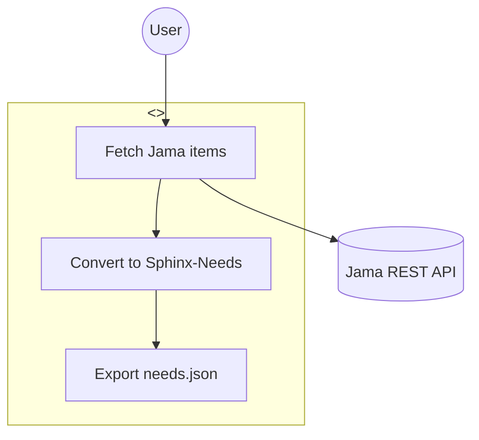
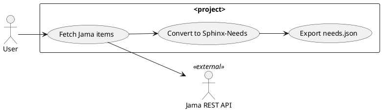

# @pharaoh.use-case-diagram-draft

Use when drafting one use-case diagram for a single feat — actors (primary, secondary, external systems), use cases (one per user-facing capability), and system boundary. Renderer-aware (mermaid or plantuml per `.pharaoh/project/diagram-conventions.yaml`). First concrete `*-diagram-draft` skill — others follow the same shape.

---

## Full atomic specification

# pharaoh-use-case-diagram-draft

## When to use

Invoke when a feat (user-facing capability) needs a use-case view. Typical caller: a plan emitted by `pharaoh-write-plan` that selects this skill via the view_map (see `shared/diagram-view-selection.md`).

Do NOT use for component decomposition — that's `pharaoh-component-diagram-draft`. Do NOT use for interaction flow — that's `pharaoh-sequence-diagram-draft`. One skill per diagram kind — see the atomic-skill criteria.

## Atomicity

- (a) One feat context + one actor list + one renderer in → one use-case diagram block out.
- (b) Input: `{feat_id: str, actors: list[{name, role, kind}], use_cases: list[str], external_systems: list[str], renderer: "mermaid" | "plantuml", tailoring_path: str}`. Output: JSON `{diagram_block: <rst_directive_str>, element_count: int}`.
- (c) Reward: fixtures in `pharaoh-validation/fixtures/pharaoh-use-case-diagram-draft/` — canonical inputs + expected outputs for both renderers. Parser gate: emitted block passes `mmdc` (mermaid) or `plantuml -checkonly` (plantuml). Required-elements gate: ≥1 actor, 1 system boundary, ≥1 use case. Element count ≤ `element_count_max` from tailoring.
- (d) Reusable for every feat that needs a use-case view.
- (e) Emits only the directive block. Does not touch conf.py, does not mutate tailoring, does not dispatch other skills (except the mandated review as last step).

## Input

- `feat_id`: the need_id of the parent feat. Used as the diagram's `:caption:` hook for `trace_to_parent`.
- `actors`: list of actor specs. Each:
  - `name`: short label (e.g. "User", "CSV file", "Jama REST API").
  - `role`: "primary" or "secondary".
  - `kind`: "human" or "system".
- `use_cases`: list of user-facing capability strings. Each becomes a use case node inside the system boundary. Derived from the feat's body (shall-clauses) or supplied by the caller.
- `external_systems`: list of labels for external participants shown outside the system boundary (databases, third-party APIs, file formats).
- `renderer`: "mermaid" or "plantuml". If unspecified, read from `tailoring_path/diagram-conventions.yaml > renderer`; if that is also unspecified, default to "mermaid".
- `tailoring_path`: absolute path to `.pharaoh/project/`. Reads `diagram-conventions.yaml` for renderer + `element_count_max` + `stereotype_aliases`.

## Output

JSON document, no prose wrapper:

```json
{
  "diagram_block": ".. mermaid::\n   :caption: FEAT_example — use case diagram\n\n   flowchart TB\n   ...",
  "element_count": 5,
  "renderer": "mermaid"
}
```

## How to emit — mermaid

Mermaid does not have a first-class use-case diagram type. Use `flowchart TB` with stereotype-labelled nodes. Shape template:



Conventions:
- `(( ))` shape = human actor.
- `[( )]` cylinder shape = external data/system actor.
- `subgraph` with a `<<system>>` prefix in its label = system boundary.
- Arrows connect actors to use cases (primary: actor → uc; secondary: uc → external).

## How to emit — plantuml

PlantUML has a first-class use-case syntax. Use it:



Conventions:
- `actor "..." as <alias>` for human actors.
- `actor "..." as <alias> <<external>>` for system actors.
- `rectangle "SystemName" { ... }` for the system boundary.
- `usecase "..." as <alias>` inside the rectangle.

## Safe labels

Every emitted label obeys [`shared/diagram-safe-labels.md`](https://github.com/useblocks/pharaoh/blob/v1.2.0/skills/shared/diagram-safe-labels.md) — no `;`, no `|`, no unescaped `"` in labels, etc. The draft output runs through `pharaoh-diagram-lint` before success.

## Relationship semantics

Use-case diagrams use association arrows (`-->`) from actor to use case, and include / extend between use cases if the scope requires. See [`shared/uml-relationship-semantics.md`](https://github.com/useblocks/pharaoh/blob/v1.2.0/skills/shared/uml-relationship-semantics.md) for the full decision matrix if include / extend are needed (rare at feat level).

## Last step

After emitting the diagram block, invoke `pharaoh-diagram-review` with `diagram_type: use_case` and `parent_need_id: <feat_id>`. Attach the returned review JSON to this skill's output under the key `review`. If review emits any critical finding, return non-success with the findings verbatim. See [`shared/self-review-invariant.md`](https://github.com/useblocks/pharaoh/blob/v1.2.0/skills/shared/self-review-invariant.md).

## Composition

Invoked as a task in plans emitted by `pharaoh-write-plan` when the plan includes a feat that selects use-case as its primary view (per `shared/diagram-view-selection.md`).
