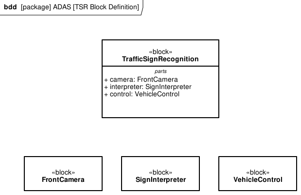
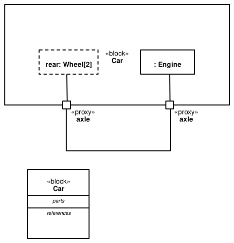




.. _SysML_Demo:

🧩 SysML diagrams alongside sphinx-needs items
===============================================

This page demonstrates how SysML diagrams can be embedded inside
Sphinx-Needs items the same way PlantUML diagrams already are. The doc
build itself stays free of any modeling-tool / Cairo / GTK
dependencies — diagrams are **pre-rendered to SVG** and committed into
the repo, then included via plain ``.. figure::`` directives.

The example model
-----------------

The Block Definition Diagram below is rendered from
``adas-tsr-bdd.gaphor`` and shows the same Traffic Sign Recognition
architecture that appears in :need:`ARCH_007` as a PlantUML component
view. It is committed as ``adas-tsr-bdd__tsr-block-definition.svg``.

   ``TrafficSignRecognition`` (top, with parts compartment) decomposed
   into ``FrontCamera``, ``SignInterpreter`` and ``VehicleControl``
   (bottom row) — pre-rendered SVG, no build-time tooling.

A second example uses Gaphor's stock SysML car BDD, dropped into the
docs tree unchanged:

   ``Car`` block with ``rear: Wheel[2]``, ``: Engine`` parts and two
   ``axle`` proxy ports — Gaphor's ``examples/sysml-car.gaphor``
   committed as-is.

Workflow
--------

The recommended workflow has two stages — **author once / re-render**
(needs Gaphor + Cairo) and **build docs** (no extra deps):

1. **Edit the model.** Author / tweak the diagram in the Gaphor desktop
   GUI (https://gaphor.org/), or programmatically via Gaphor's Python
   API. The script :file:`author_adas_bdd.py` in this directory shows
   the API path for the TSR BDD.

2. **Re-render to SVG** on a developer machine that has the Cairo /
   GTK system libraries installed:

   .. code:: console

      uv sync --extra render
      uv run python docs/automotive-adas/sysml/render_sysml.py

   Every ``.gaphor`` file under this directory gets rendered into one
   SVG per diagram, named ``<gaphor stem>__<slug>.svg``.

3. **Commit** the regenerated SVG (and the ``.gaphor`` source).

4. **Build docs** with the normal toolchain — no Gaphor, no Cairo, no
   GTK on Read-the-Docs or in CI.

Using existing SysML 1.5 XMI
-----------------------------

A common ask is *"we already have SysML 1.5 XMI files from
Cameo / Papyrus / MagicDraw / Rhapsody — can we drop them in?"* The
practical answer is: **render them once in your existing tool, commit
the resulting SVG, and skip the conversion entirely**.

- All major SysML authoring tools (Cameo Systems Modeler, Eclipse
  Papyrus, IBM Rhapsody, Sparx Enterprise Architect, MagicDraw) export
  individual diagrams as SVG or PNG out of the box.
- The ``.gaphor`` format is **not** XMI — it is a Gaphor-native XML
  schema with embedded layout. Converting XMI → ``.gaphor`` requires a
  custom translator (Gaphor's own XMI export was removed in 3.1.0,
  `gaphor/gaphor#3444 <https://github.com/gaphor/gaphor/pull/3444>`__).
- Treating the SysML diagram as **just an image asset** sidesteps the
  format-translation problem and works for every SysML tool the
  customer might already own.

If a project still wants the ``.gaphor``-as-code path (text diff, easy
PR review, `author_adas_bdd.py` style), Gaphor's GUI also imports a
limited subset of UML XMI 2.5 — see the Gaphor docs for the current
state.

Trade-offs to be aware of
-------------------------

- The pre-render step is **manual**: edit a model → run the render
  script → commit. Mitigations: a ``make render`` target, a CI job
  that regenerates SVGs when ``.gaphor`` files change and pushes back,
  or a pre-commit hook.
- The diagram is now **a binary-ish asset in the repo** (SVG is text,
  but auto-laid-out XML diffs poorly). The ``.gaphor`` source is the
  reviewable artifact; the SVG is the build output.
- For a customer with hundreds of SysML 1.5 XMI diagrams, scripting a
  bulk export (e.g., a Cameo macro or a Papyrus headless build) is the
  next step beyond this prototype.
