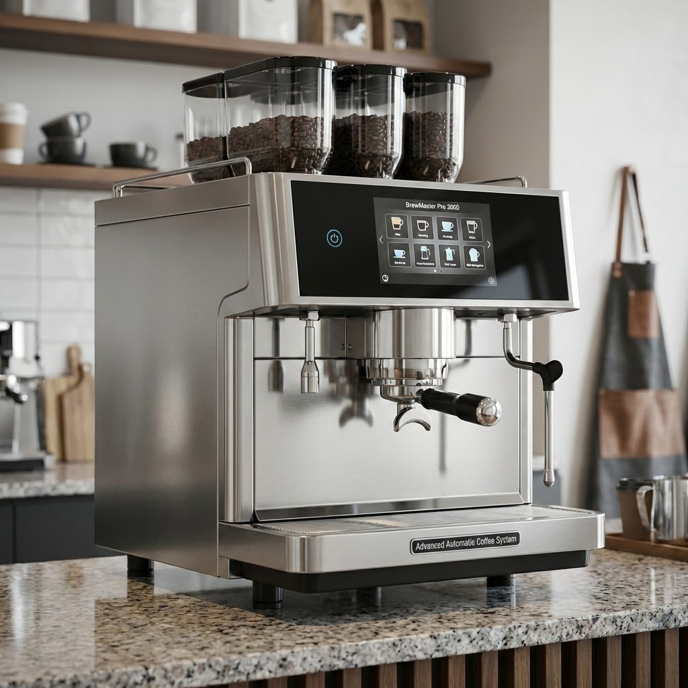

☕️ Coffee Machine Example
==========================

This example demonstrates a complete traceability chain for a coffee
machine system, from high-level requirements down to implementation
and test cases.

The **BrewMaster Pro 3000** is an advanced automatic coffee machine
designed for commercial and high-end residential use. Featuring
precision temperature control, customizable brew strength settings,
and comprehensive safety mechanisms, it represents the cutting edge of
coffee brewing technology. This document traces the complete
development lifecycle from initial customer needs through verified
implementation.

System Requirements
-------------------

The system requirements capture the fundamental capabilities that the
BrewMaster Pro 3000 must deliver to meet customer expectations and
safety standards. These high-level requirements define what the system
does from an external perspective, focusing on user-visible behavior
and safety constraints. Each requirement has been derived from market
analysis, customer feedback, and applicable safety regulations for
household appliances.

.. req:: Brew Coffee
   :id: REQ_BREW_COFFEE
   :status: open
   :tags: brewing, core
   :collapse: true

   The coffee machine shall be able to brew coffee with user-selected
   strength (weak, medium, strong).

.. req:: Heat Water
   :id: REQ_HEAT_WATER
   :status: open
   :tags: heating, safety
   :collapse: true

   The coffee machine shall heat water to the appropriate temperature
   (85-95°C) for brewing coffee.

.. req:: User Interface
   :id: REQ_USER_INTERFACE
   :status: open
   :tags: ui, usability
   :collapse: true

   The coffee machine shall provide a user interface with buttons for
   selecting coffee strength and starting the brewing process.

.. req:: Safety Shutdown
   :id: REQ_SAFETY_SHUTDOWN
   :status: open
   :tags: safety, critical
   :collapse: true

   The coffee machine shall automatically shut down if the water
   temperature exceeds 100°C or if no water is detected.

Software Requirements
---------------------

The software requirements section refines the high-level system
requirements into detailed, implementable specifications for the
embedded control system. The BrewMaster Pro 3000 runs on a custom
Python-based embedded platform with real-time capabilities, chosen for
its rapid development cycle and extensive library support. These
requirements specify precise timing constraints, control algorithms,
and safety-critical behavior that must be implemented in software.
Each software requirement is traceable back to one or more system
requirements, ensuring complete coverage of customer needs.

.. swreq:: Temperature Regulation
   :id: SWREQ_TEMP_REGULATION
   :status: open
   :tags: control, heating
   :reqs: REQ_HEAT_WATER
   :collapse: true

   The temperature control software shall monitor the water temperature
   sensor and regulate the heating element to maintain temperature
   between 85-95°C using PID control.

.. swreq:: Over-Temperature Shutdown
   :id: SWREQ_OVERTEMP_SHUTDOWN
   :status: open
   :tags: safety, critical
   :reqs: REQ_SAFETY_SHUTDOWN
   :collapse: true

   The software shall continuously monitor water temperature and trigger
   an emergency shutdown within 100ms if temperature exceeds 100°C to
   prevent boiling and potential hazards.

.. swreq:: Brew Strength Selection
   :id: SWREQ_BREW_STRENGTH
   :status: open
   :tags: control, brewing
   :reqs: REQ_BREW_COFFEE
   :collapse: true

   The software shall implement brew strength selection by controlling
   the water flow rate and brewing time:

   - Weak: 180ml water, 3 minutes
   - Medium: 180ml water, 4 minutes
   - Strong: 180ml water, 5 minutes

.. swreq:: Button Input Handler
   :id: SWREQ_BUTTON_INPUT
   :status: open
   :tags: ui, input
   :reqs: REQ_USER_INTERFACE
   :collapse: true

   The software shall process button inputs with debouncing and trigger
   appropriate actions (strength selection, start brewing, stop/cancel).

.. swreq:: Water Level Monitoring
   :id: SWREQ_WATER_LEVEL
   :status: open
   :tags: safety, monitoring
   :reqs: REQ_SAFETY_SHUTDOWN
   :collapse: true

   The software shall continuously monitor the water level sensor and
   prevent brewing operations when water level is below minimum
   threshold.

Software Architecture
---------------------

The software architecture defines the modular structure of the
BrewMaster Pro 3000's embedded control system. The architecture
follows a layered approach with clear separation of concerns:
safety-critical functions are isolated in dedicated modules, control
algorithms are encapsulated for reusability, and user interface logic
is decoupled from core brewing operations. This modular design enables
independent testing, facilitates maintenance, and provides clear
interfaces between components.

The architecture emphasizes fail-safe design principles. The Safety
Monitor Module operates with the highest priority and can override all
other subsystems. Module dependencies are carefully managed to prevent
circular references and ensure deterministic behavior. The following
diagram shows the architectural modules and their relationships:

.. needflow::
   :types: component, interface
   :filter: docname is not None and "coffee-machine" in docname

.. component:: Temperature Controller Module
   :id: COMP_TEMP_CTRL
   :status: open
   :tags: module, control
   :implements: SWREQ_TEMP_REGULATION
   :provides: INTF_TEMP_STATUS, INTF_SAFETY_STATUS
   :consumes: INTF_SAFETY_CMD, INTF_SENSOR_DATA
   :collapse: true

   Module responsible for PID-based temperature control. Interfaces:

   - Input: Temperature sensor (ADC)
   - Output: Heating element PWM control
   - Safety: Reports temperature status to Safety Monitor
   - Safety: Responds to emergency shutdown commands

.. component:: Brew Controller Module
   :id: COMP_BREW_CTRL
   :status: open
   :tags: module, control
   :implements: SWREQ_BREW_STRENGTH
   :provides: INTF_SAFETY_STATUS
   :consumes: INTF_TEMP_STATUS, INTF_SAFETY_CMD, INTF_USER_CMD
   :collapse: true

   Module managing the brewing process state machine. States: IDLE,
   HEATING, BREWING, COMPLETE, ERROR. Controls pump and valve timing
   based on selected strength. Waits for temperature ready signal before
   initiating brew cycle. Monitors safety status continuously.

.. component:: User Interface Module
   :id: COMP_UI_MODULE
   :status: open
   :tags: module, ui
   :implements: SWREQ_BUTTON_INPUT
   :provides: INTF_USER_CMD
   :collapse: true

   Module handling all user interactions including button debouncing, LED
   status indicators, and display updates. Interfaces with the Brew
   Controller to send user commands (strength selection, start/stop).

.. component:: Safety Monitor Module
   :id: COMP_SAFETY_MON
   :status: open
   :tags: module, safety
   :implements: SWREQ_WATER_LEVEL, SWREQ_OVERTEMP_SHUTDOWN
   :provides: INTF_SAFETY_CMD
   :consumes: INTF_SAFETY_STATUS, INTF_SENSOR_DATA
   :collapse: true

   Module performing continuous safety checks on temperature and water
   level. Implements fail-safe shutdown procedures.

.. component:: Hardware Abstraction Layer
   :id: COMP_HAL
   :status: open
   :tags: module, hardware, driver
   :provides: INTF_SENSOR_DATA
   :collapse: true

   Module providing abstraction over hardware sensors and actuators.
   Handles low-level sensor reading via ADC, signal conditioning, and
   calibration. Interfaces:

   - Input: Temperature sensor (NTC thermistor via ADC channel 0)
   - Input: Water level sensor (capacitive via ADC channel 1)
   - Output: Heating element control (PWM channel)
   - Output: Pump control (GPIO)

   Implements DMA-based ADC sampling at 100Hz with automatic averaging
   and outlier rejection for robust sensor readings.

Component Interfaces
^^^^^^^^^^^^^^^^^^^^

The following interfaces define the communication contracts between
architectural components. Each interface specifies the data exchanged,
protocols used, and timing constraints to ensure deterministic and
safe inter-component communication.

.. interface:: Temperature Status Interface
   :id: INTF_TEMP_STATUS
   :status: open
   :tags: interface, control
   :collapse: true

   **Provider**: Temperature Controller Module

   **Consumer**: Brew Controller Module

   **Description**: Provides current temperature readings and heating
   status to the brew controller.

   **Data Elements**:

   - current_temp: int16 (°C × 10 for 0.1°C resolution)
   - target_temp: int16 (°C × 10)
   - is_ready: bool (true when within target range)
   - heating_active: bool

   **Protocol**: Shared memory with atomic updates, 100ms refresh rate

.. interface:: Safety Command Interface
   :id: INTF_SAFETY_CMD
   :status: open
   :tags: interface, safety
   :collapse: true

   **Provider**: Safety Monitor Module

   **Consumers**: Temperature Controller, Brew Controller

   **Description**: Emergency shutdown commands from safety monitor to
   all controlled subsystems.

   **Commands**:

   - EMERGENCY_STOP: Immediate shutdown (<100ms response required)
   - RESUME_NORMAL: Clear emergency state after fault resolved

   **Protocol**: Interrupt-driven with hardware watchdog backup, highest
   priority

.. interface:: Safety Status Interface
   :id: INTF_SAFETY_STATUS
   :status: open
   :tags: interface, safety
   :collapse: true

   **Providers**: Temperature Controller, Brew Controller

   **Consumer**: Safety Monitor Module

   **Description**: Continuous status reporting from all modules to the
   safety monitor for fault detection.

   **Data Elements**:

   - module_id: uint8
   - heartbeat_counter: uint32 (incremented each cycle)
   - fault_flags: uint16 (bitfield of detected faults)
   - temperature_value: int16 (from temp controller)
   - water_level: uint8 (0-100%)

   **Protocol**: Polled by safety monitor at 10Hz

.. interface:: User Command Interface
   :id: INTF_USER_CMD
   :status: open
   :tags: interface, ui
   :collapse: true

   **Provider**: User Interface Module

   **Consumer**: Brew Controller Module

   **Description**: User commands and settings passed from UI to the
   brewing state machine.

   **Commands**:

   - START_BREW(strength: enum {WEAK, MEDIUM, STRONG})
   - STOP_BREW
   - SELECT_STRENGTH(strength: enum)

   **Protocol**: Message queue with event-driven processing, debounced at
   UI layer

.. interface:: Sensor Data Interface
   :id: INTF_SENSOR_DATA
   :status: open
   :tags: interface, hardware
   :collapse: true

   **Provider**: Hardware sensors (temperature, water level)

   **Consumers**: Temperature Controller, Safety Monitor

   **Description**: Raw sensor readings from hardware via ADC.

   **Data Elements**:

   - temp_sensor_raw: uint16 (ADC value 0-4095)
   - water_level_raw: uint16 (ADC value 0-4095)
   - sensor_timestamp: uint32 (milliseconds)

   **Protocol**: ADC DMA with double buffering, 100Hz sampling rate

Implementation
--------------

The implementation phase translates the architectural designs into
working code. All BrewMaster Pro 3000 software is implemented in Rust,
leveraging its memory safety guarantees, zero-cost abstractions, and
excellent embedded systems support.

The choice of Rust provides critical advantages for safety-critical
applications: compile-time memory safety prevents entire classes of
bugs, the type system enforces correct API usage, and the no_std
capability enables bare-metal operation if needed. The implementation
follows strict coding standards including comprehensive documentation,
clippy linting at the pedantic level, and zero unsafe code in
safety-critical modules.

Each implementation artifact maps directly to an architectural module,
ensuring traceability from design to code. The code is organized as a
Cargo workspace located in ``../../brewmaster-controller/`` relative
to this documentation, with clear module boundaries matching the
architectural decomposition.

.. impl:: Temperature PID Controller
   :id: IMPL_TEMP_PID
   :status: open
   :tags: rust, control, embedded
   :realizes: COMP_TEMP_CTRL
   :collapse: true

   Implementation: ``brewmaster-controller/src/temperature.rs::TemperatureController``

   PID controller with Kp=2.0, Ki=0.5, Kd=1.0 tuned for rapid heating
   with minimal overshoot. Implements fixed-point arithmetic for
   deterministic real-time behavior without floating-point dependencies.

.. impl:: Brew State Machine
   :id: IMPL_BREW_FSM
   :status: open
   :tags: rust, control, embedded
   :realizes: COMP_BREW_CTRL
   :collapse: true

   Implementation: ``brewmaster-controller/src/brew_controller.rs::BrewStateMachine``

   Type-safe finite state machine using Rust enums. Manages brewing
   workflow with configurable timing parameters per strength setting.
   State transitions are compile-time verified to prevent invalid states.

.. impl:: Button Handler
   :id: IMPL_BUTTON_HANDLER
   :status: open
   :tags: rust, ui, embedded
   :realizes: COMP_UI_MODULE
   :collapse: true

   Implementation: ``brewmaster-controller/src/ui.rs::ButtonHandler``

   Interrupt-driven button handler with 50ms debounce using hardware
   timer. Sends commands to the brew state machine via type-safe message
   passing channels to ensure thread safety.

.. impl:: Safety Watchdog
   :id: IMPL_SAFETY_WATCHDOG
   :status: open
   :tags: rust, safety, embedded
   :realizes: COMP_SAFETY_MON
   :collapse: true

   Implementation: ``brewmaster-controller/src/safety.rs::SafetyWatchdog``

   High-priority task running at 10Hz monitoring all safety-critical
   parameters. Implements hardware watchdog timer reset to prevent
   lockup. Uses lock-free atomic operations for zero-allocation safety
   checks.

.. impl:: Hardware Abstraction Layer
   :id: IMPL_HAL
   :status: open
   :tags: rust, hardware, driver, embedded
   :realizes: COMP_HAL
   :collapse: true

   Implementation: ``brewmaster-controller/src/hal.rs::HardwareAbstractionLayer``

   Hardware abstraction layer providing sensor data acquisition and
   actuator control. Uses DMA-based ADC sampling with circular buffering
   for zero-copy operation. Implements calibration tables for NTC
   thermistor linearization (Steinhart-Hart equation) and capacitive
   water level sensor compensation. PWM generation uses hardware timers
   with 10kHz frequency for heating element control. All hardware access
   is abstracted through safe Rust interfaces using embedded-hal traits.

Test Cases
----------

Comprehensive testing ensures that the BrewMaster Pro 3000 meets all
specified requirements and operates safely under all conditions. The
test strategy employs multiple levels:

- **Unit Tests**: Verify individual components in isolation (temperature
  control, button debouncing, state machine transitions)
- **Integration Tests**: Validate interactions between modules (brew
  controller coordinating with temperature controller)
- **System Tests**: End-to-end verification of complete brewing cycles
- **Safety Tests**: Dedicated verification of all safety-critical
  functions under normal and fault conditions

All tests are automated and integrated into the continuous integration
pipeline. Safety-critical tests are executed on hardware-in-the-loop
test benches that simulate real sensors, actuators, and fault
conditions. Test coverage targets are set based on the criticality of
each component.

.. test:: Test Temperature Control
   :id: TEST_TEMP_CONTROL
   :status: open
   :tags: unit, control
   :specs: SWREQ_TEMP_REGULATION
   :collapse: true

   **Objective**: Verify temperature controller maintains target
   temperature within ±2°C.

   **Steps**:

   1. Initialize controller with target 90°C
   2. Simulate temperature sensor readings from 20°C to 95°C
   3. Record PWM output at each temperature

   **Expected**: PWM duty cycle decreases as temperature approaches
   target, maintains oscillation within ±2°C of setpoint.

.. test:: Test Brew Strength Settings
   :id: TEST_BREW_STRENGTH
   :status: open
   :tags: integration, brewing
   :specs: SWREQ_BREW_STRENGTH
   :collapse: true

   **Objective**: Verify all three strength settings produce correct
   timing and water volume.

   **Test Cases**:

   - Weak: Assert 180ml water dispensed in 3 min ±5s
   - Medium: Assert 180ml water dispensed in 4 min ±5s
   - Strong: Assert 180ml water dispensed in 5 min ±5s

.. test:: Test Button Debouncing
   :id: TEST_BUTTON_DEBOUNCE
   :status: open
   :tags: unit, ui
   :specs: SWREQ_BUTTON_INPUT
   :collapse: true

   **Objective**: Verify button handler correctly debounces rapid inputs.

   **Steps**:

   1. Simulate 10 button presses within 200ms
   2. Count triggered events

   **Expected**: Only 1-2 events triggered (first press + possible bounce
   after 50ms timeout).

.. test:: Test Safety Shutdown
   :id: TEST_SAFETY_SHUTDOWN
   :status: open
   :tags: integration, safety
   :specs: SWREQ_OVERTEMP_SHUTDOWN, SWREQ_WATER_LEVEL
   :collapse: true

   **Objective**: Verify safety monitor triggers shutdown on critical
   conditions.

   **Test Cases**:

   - Over-temperature: Set temp > 100°C, assert shutdown within 100ms
   - Low water: Set water level < threshold, assert brewing prevented
   - Watchdog timeout: Block safety loop, assert hardware reset within 1s

.. test:: Test End-to-End Brewing
   :id: TEST_E2E_BREWING
   :status: open
   :tags: system, e2e
   :specs: SWREQ_BREW_STRENGTH, SWREQ_TEMP_REGULATION, SWREQ_BUTTON_INPUT
   :collapse: true

   **Objective**: Verify complete brewing cycle from user input to coffee
   output.

   **Steps**:

   1. Select medium strength
   2. Press start button
   3. Monitor temperature, water flow, and timing

   **Expected**: System heats to 85-95°C, dispenses 180ml over 4 minutes,
   returns to idle state, no safety triggers.

Traceability Overview
---------------------

Complete traceability is a cornerstone of the BrewMaster Pro 3000
development process. Every line of code can be traced back through
architectural designs and requirements to the original customer need
or safety regulation. Conversely, every requirement can be traced
forward to its implementation and verification test cases. This
bidirectional traceability ensures nothing is missed and enables rapid
impact analysis when requirements change.

The sphinx-needs tool automates traceability management, maintaining
links between artifacts and generating visual diagrams. This example
demonstrates:

- **Requirements → SW Requirements**: High-level needs decomposed into
  software-specific requirements
- **SW Requirements → Architecture**: Requirements mapped to software
  modules
- **Architecture → Implementation**: Architectural designs realized in
  code
- **Implementation → Tests**: All implementations verified through test
  cases

Use the query tools to explore the relationships between these needs
and verify complete traceability coverage.

Traceability Diagram
^^^^^^^^^^^^^^^^^^^^

The following diagram shows all needs and their connections in this
coffee machine example:

.. needflow::
   :types: req, swreq, component, interface, impl, test
   :filter: docname is not None and "coffee-machine" in docname
   :show_link_names:
   :show_filters:
