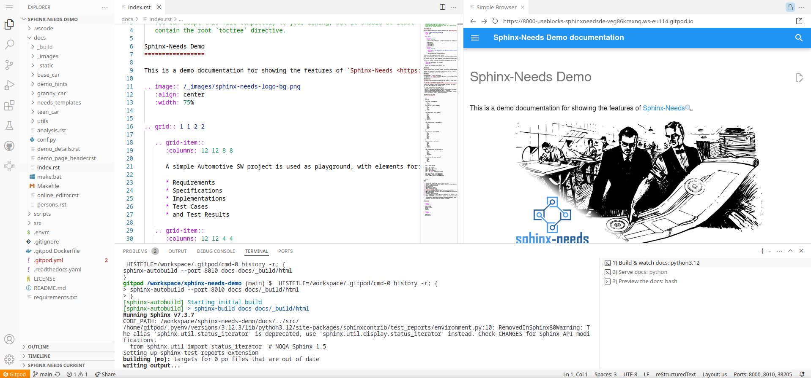

.. _online_editor:

⌨ Online Editor
===============

.. grid:: 1 1 2 2

   .. grid-item::
      :columns: 12 12 8 8

      The source code of the Sphinx-Needs-Demo project can be loaded automatically in a preconfigured
      VS Code instance on Gitpod, which allows to change data, test some features and see the outcome as a preview
      in the browser. And this all without any installation or costs on your side.

   .. grid-item::
      :columns: 12 12 4 4

      .. button-link:: https://gitpod.io/#https://github.com/useblocks/sphinx-needs-demo
         :color: primary
         :shadow:

         Start Online Editor NOW!

Start the Online Editor
-----------------------

.. hint::

   It may take up to a minute to start the Online Editor (~30s) and build the docs (~25s). 
   After this, the documentation build is only building updated files, which is normally done in under a second.

#. Open the following link in your browser:
   https://gitpod.io/#https://github.com/useblocks/sphinx-needs-demo
#. You are asked to log in with a Gitpod or Github account.
#. Select the editor to use. Recommended for this demo is ``VS Code Browser``.
   
   .. image:: /_images/gitpod_config.png
      :align: center
      :width: 40%

#. An instance is started, which

   #. Checks out the Sphinx-Needs-Demo repository.
   #. Installs all needed dependencies for the operating system and the Python environment.
   #. Loads preconfigured VS Code extensions, to support you with the development of the documentation.
   #. Start an initial documentation build.
   #. Shows the documentation build result as a preview in a browser.

After everything is running:

#. Feel free to edit and save any file under ``docs``.
#. With each change, the docs get built automatically and you can see the result in the preview, after refreshing the page 
   (normally by pressing ``F5``).

Ideas for playing around
------------------------

#. Create a new file ``playground.rst`` under ``/docs/``.
#. Add ``playground`` to the ``.. toctree::`` in the ``/docs/index.rst`` file (end of the file).
   "Playground" shows up in the left side-menu of the built documentation.
#. Set a title in ``playground.rst``::

      Playground
      ==========

#. Set a ``needtable`` to get an overview of all Sphinx-Needs objects in the documentation::

      .. needtable::

#. Add your own requirements::

      .. req:: My requirement
         :id: REQ_FIRST

#. Add a specification and link it::

      .. spec:: My spec
         :id: SPEC_MY
         :links: REQ_FIRST

#. Get the traceability tree of your requriement by using ``needflow``::

      .. needflow::
         :root_id: REQ_FIRST

Share your docs
---------------

Your specific build of the Sphinx-Needs-Demo project is publicly available and can be shared 
with colleagues and other users around the world, as long as your Gitpod instance is running.

You can get the link by opening the "ports" tab and copy the address entry for the port "8000".

.. image:: /_images/editor_ports.gif
   :align: center

Debug the docs
--------------
If anything is not working, here are some locations where to look for the problem

Documentation  build problems
~~~~~~~~~~~~~~~~~~~~~~~~~~~~~

In the ``Terminal` app, you will see 3 open terminals on the right side:

1. Build & watch docs
2. Serve docs
3. Preview the docs

``1) Build & watch docs`` is the important one, because there the documentation build output is shown and
therefore also all warnings and errors.

.. image:: /_images/gitpod_terminals.png
   :width: 80%
   :align: center

Extension problems
~~~~~~~~~~~~~~~~~~
If any VS Code extension is not working as it should, or errors are popping up in the editor itself, take a look
into the extension-specific output.

For this, open the ``Output`` tab. On the right side is a small select box, which shows all extensions.
Select one and you see its log messages.

.. image:: /_images/gitpod_outputs.png
   :width: 80%
   :align: center
